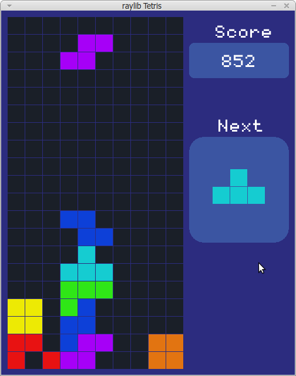

# Tetris Raylib

Using template from [raylib-cpp-starter](https://github.com/CapsCollective/raylib-cpp-starter)
Guide from [Creating Tetris in C++ with raylib - Beginner Tutorial (OOP)](https://www.youtube.com/watch?v=wVYKG_ch4yM)
If it's developed using neovim and clangd LSP not detect anything do:
- use bear
    - sudo apt-get install bear
    - bear -- make
- if some library not found
    - sudo apt install g++-12 [clang++ cannot find iostream](https://askubuntu.com/questions/1449769/clang-cannot-find-iostream)


## Tips

add this mapping to neovim config to fast run from neovim
```lua
      function()
        local path = vim.fn.getcwd()
        local command = path .. '/run.sh'
        os.execute(command)
      end, 'Run ./run.sh on root project'
```

## Build and Run

I only do this on Ubuntu/Linux Mint

### Linux

```
$ make setup
$ make

```
